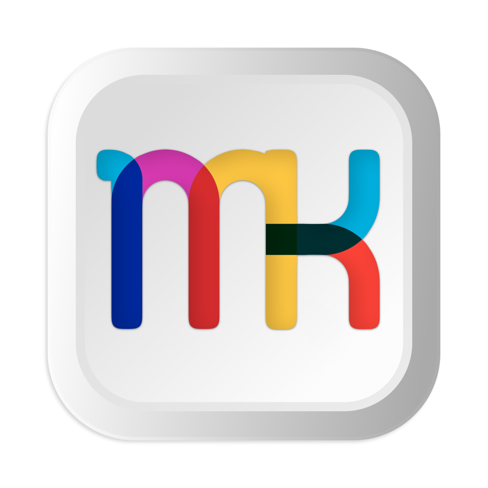
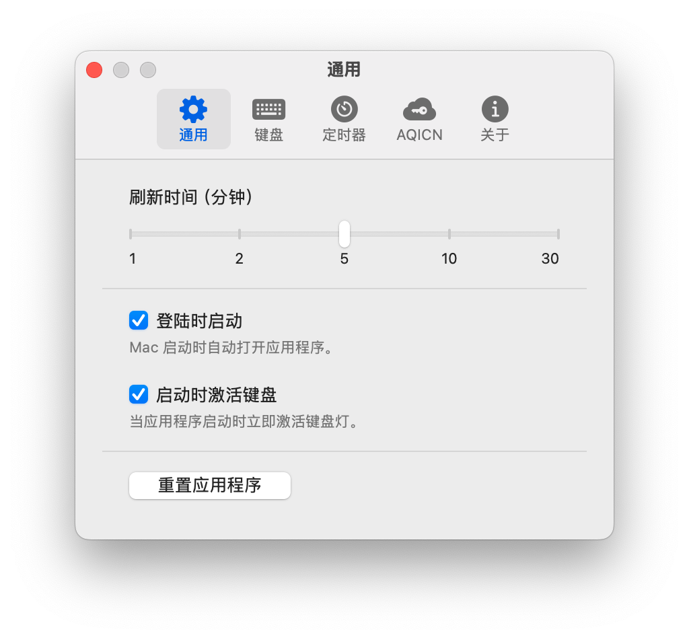
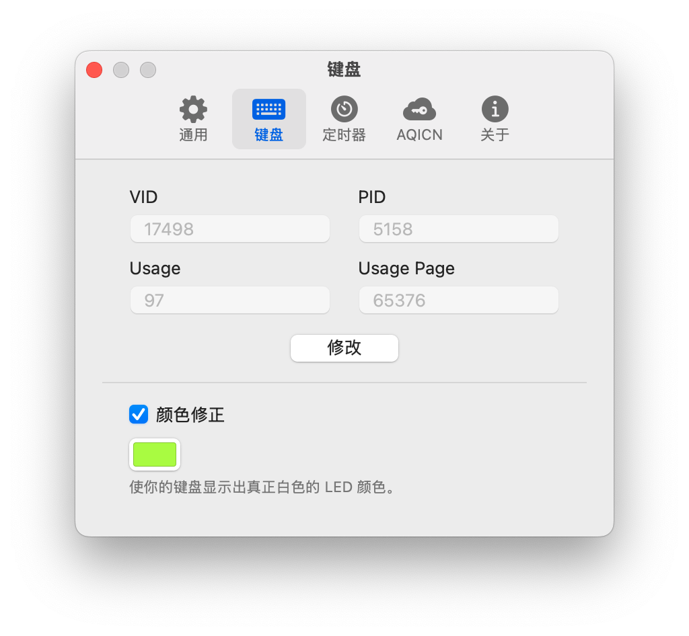
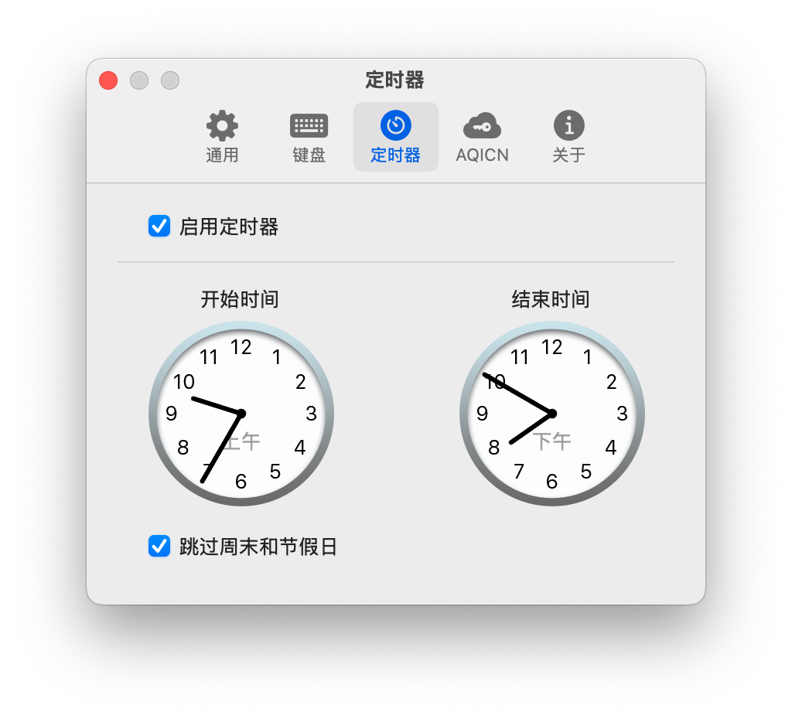
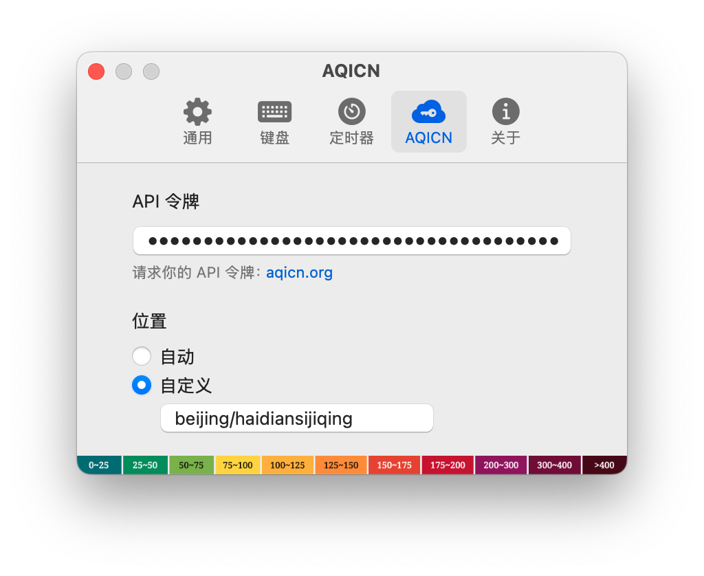
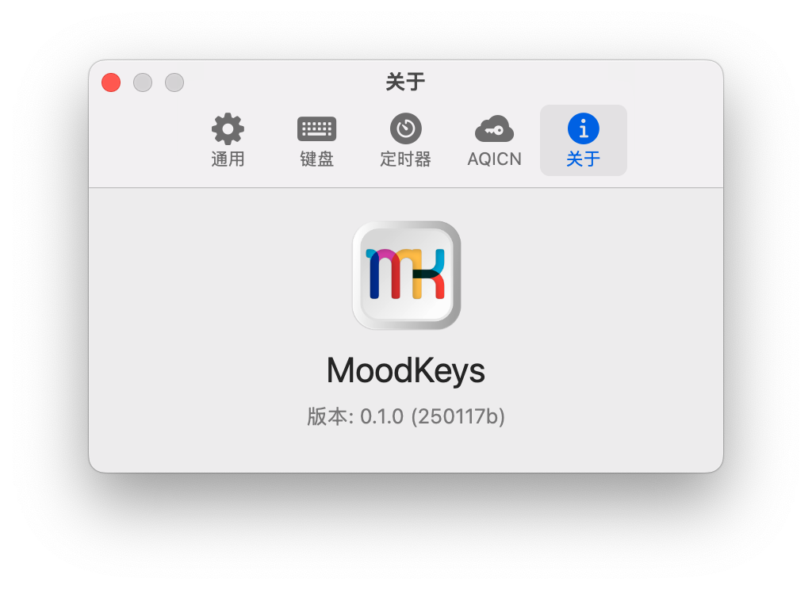

	

<h1 align="center">MoodKeys</h1>

	
	
  

Make full use of your customizable keyboard RGB lighting to display the current air quality (looking forward to more features).

## Features

- Timer function
- Automatically skip weekends and (China’s) statutory holidays
- Customizable geographic location
- Lighting color calibration algorithm (most keyboard switch top covers are colored)

## Screenshots

    
    

	
	
	

## Used Network APIs

- [holiday](https://github.com/Haoshenqi0123/holiday)

- [aqicn](https://aqicn.org/data-platform/token/)
